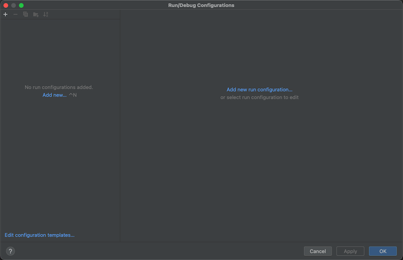
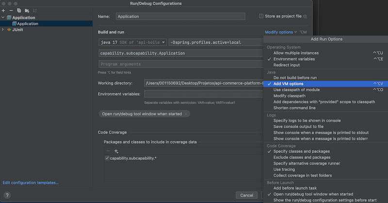

# talk2me-infra

## Criando a private-key

``` shel
ssh-keygen -m PEM -t rsa -b 4096 -C "seu@mail.com.br" -f ./.ssh/config_server_talk2me.rsa
```

## <a id = "ferr"></a> Ferramentas Necessárias
- JDK 17 +
- IDE de sua preferência

## <a id = "setupprojeto"></a> Setup do Projeto

Usando o IntelliJ será necessário também a adicionar a opção VM Options para definir
o profile que será utilizado para a execução da aplicaçao.
<br>

```bash 
-Dspring.profiles.active=dev
```

### Configuração do maven no IntelliJ IDEA
Para que a IDE consiga baixar as dependências corretamente é necessário configuração das propriedades de build,
para isso precisamos acessar:
``` text
Preferencia -> Build, Execution, Deployment -> Build Tooles -> Maven
```
E adicionar oo Maven home path `Bundled (Maven 3)`


### Configurar o ambiente no IntelliJ IDEA
1. Para realizar a configuração da aplicação e do profile que iremos rodar a aplicação acesse a opção
   `Add Confituration`


2. Adicione uma nova aplicação



3. Configure as variáveis


4. Para configurar qual profile irá rodar a aplicação acesse e configure `-Dspring.profiles.active=local`, caso queira
   rodar em profile diferente basta mudar o `local` para o ambiente desejado ex: `-Dspring.profiles.active=dev`.
``` text
Modify options -> Add VM option
```

